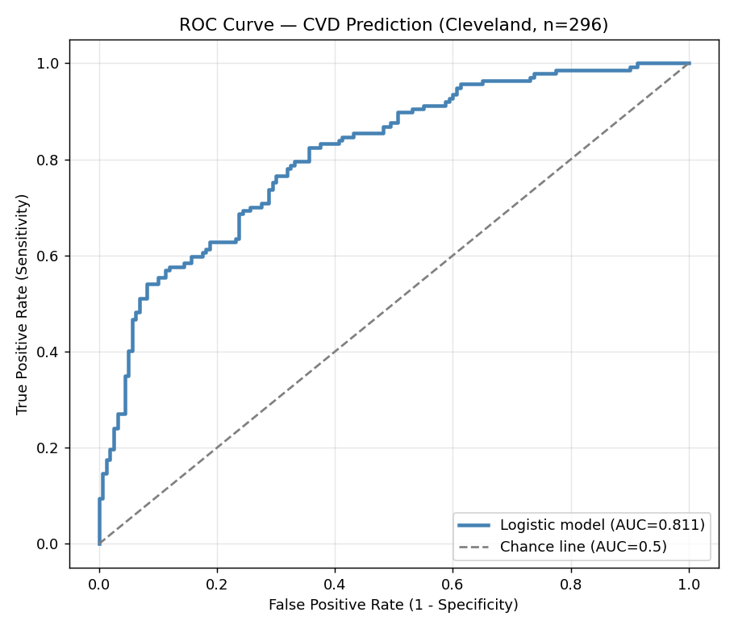

# Cardiovascular Risk Modelling — Cleveland Heart Disease Cohort

Logistic regression analysis predicting heart disease using the Cleveland Heart Disease dataset (297 patients, 14 clinical variables). Built in R as part of an interview preparation portfolio for a Werkstudent role in Clinical Affairs.

**Author:** Kunal Patil - MSc Digital Health , Deggendorf Institute of Technology
**Stack:** R · tidyverse · pROC · broom · glm

---

## Clinical Question

Which patient characteristics predict heart disease in this cohort, and how well can a logistic regression model discriminate between affected and unaffected individuals?

## Dataset

Cleveland Heart Disease cohort - 297 patients, 14 clinical and demographic variables. Disease prevalence 46.1% (well-balanced classes). Target variable `condition` (1 = disease present, 0 = no disease).

## Methodology

- Descriptive statistics on key clinical variables (age, blood pressure, cholesterol, max heart rate)
- Univariate group comparisons:
  - **t-test** for continuous variables (age by disease status)
  - **chi-square** for categorical variables (sex vs disease)
- Multivariate **logistic regression** (`glm`, `family = binomial`) for interpretable odds ratios
- **ROC curve** and **AUC** for model performance
- Honest reporting of in-sample evaluation as a known optimistic estimate

## Results

| Variable | Odds Ratio | 95% CI | p-value | Significant |
|---|---|---|---|---|
| age | 1.014 | 0.98 – 1.05 | 0.425 | No |
| **sex (male)** | **5.94** | **3.05 – 11.56** | **<0.001** | Yes *** |
| trestbps (resting BP) | 1.021 | 1.005 – 1.038 | 0.012 | Yes * |
| chol (cholesterol) | 1.007 | 1.001 – 1.012 | 0.014 | Yes * |
| **thalach (max heart rate)** | **0.955** | **0.940 – 0.969** | **<0.001** | Yes *** |

**Model AUC: 0.811** (in-sample) — falls in the "good" performance range.

## Key Findings

- **Sex is the dominant predictor.** Males have approximately 6× the odds of heart disease compared to females, holding other variables constant.
- **Maximum heart rate is strongly protective.** Each additional bpm achieved during exercise testing reduces odds by 4.5% — consistent with thalach as a cardiovascular fitness marker.
- **Age shows a confounding pattern.** Age was significant in the univariate t-test (p < 0.001) but lost significance in the multivariate model (p = 0.43) after adjusting for thalach. Age and max heart rate are correlated, so thalach absorbs the age effect once it is in the model.

## ROC Curve



## Why Logistic Regression

Chosen deliberately over more complex models (random forests, gradient boosting) for **interpretable odds ratios** with confidence intervals. In clinical decision support, regulators and clinicians need to understand *why* a prediction is made, not just *what*. Logistic regression yields directly defensible coefficients that fit into a Post-Market Clinical Follow-up (PMCF) report under EU MDR Article 61.

## Honest Limitations

- **Evaluation is in-sample.** The model was trained and evaluated on all 297 patients. The AUC of 0.811 is therefore an optimistic estimate of real-world performance.
- **Next step: k-fold cross-validation** (k = 5) to obtain a stable out-of-fold AUC estimate and quantify variance across folds.
- **Single dataset.** Validation on an independent cohort (e.g. NHANES or a European registry) would strengthen external validity.

## Reproducibility

```r
# Required packages
install.packages(c("tidyverse", "pROC", "broom"))

# Run the analysis
source("cvd_analysis_final.R")
```

The script loads `heart_disease.csv` from the working directory, fits the model, prints odds ratios and confidence intervals, and renders the ROC curve.

## Files

- `cvd_analysis_final.R` — the analysis script
- `heart_disease.csv` — the Cleveland Heart Disease dataset (n = 297)
- `roc_curve_cvd.png` — the ROC plot


